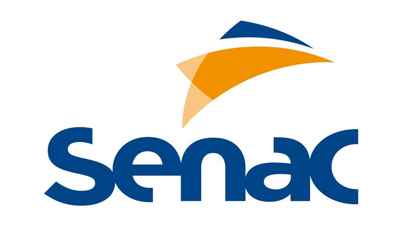

  

# 🚀 Sistema de Reserva de Ocupação - Hackathon Senac

### Uma solução inovadora do **Grupo Vermelho** para otimizar a gestão de espaços.

  <em>Desenvolvido por alunos do Ensino Médio Técnico como proposta para o Hackathon Senac.</em>

---

## 💡 A Nossa Missão: O Desafio

Nós somos o **Grupo Vermelho**, e nossa missão neste Hackathon foi resolver um desafio real e presente no dia a dia do Senac: **como gerenciar a reserva de salas e espaços de forma eficiente, transparente e sem conflitos?**

Identificamos os seguintes pontos de dor no processo tradicional:

- 🤯 **Falta de Transparência:** Era difícil saber quais horários estavam realmente livres sem consultar uma pessoa ou uma planilha complexa.
- ⏳ **Processos Manuais:** As solicitações por e-mail ou formulários de papel são lentas e podem se perder.
- ⚠️ **Risco de Conflitos:** Agendamentos duplicados para o mesmo espaço e horário eram uma possibilidade real, causando frustração.

Nossa resposta a este desafio é uma plataforma web completa, construída do zero.

---

## ✨ A Nossa Solução: Uma Plataforma Centralizada e Inteligente

Criamos um sistema web que не apenas resolve os problemas, mas também cria uma experiência de usuário fantástica para cada tipo de pessoa envolvida.

Nossa solução se baseia em **três pilares (ou perfis de usuário)**:

| Perfil               | Quem é?           | Qual o seu superpoder?                                         |
| :------------------- | :---------------- | :------------------------------------------------------------- |
| 👨‍💼 **Administrador** | O Gestor do Senac | **Aprovar, recusar e gerenciar** todas as reservas e usuários. |
| 👨‍💻 **Funcionário**   | A equipe do Senac | **Solicitar espaços** e acompanhar o status em tempo real.     |
| 👤 **Público**       | A comunidade      | **Visualizar a disponibilidade** de forma rápida e anônima.    |

---

## 🔧 Como Funciona na Prática? (Demonstração)

Vamos navegar pelas funcionalidades de cada perfil.

### 👨‍💼 **O Painel do Administrador: O Centro de Controle**

O administrador tem uma visão 360º de tudo o que acontece.

- ✅ **Aprovação Ágil:** Com um clique, as solicitações pendentes são aprovadas ou recusadas.
- 📊 **Dashboard Inteligente:** Métricas rápidas sobre o total de reservas, quantas estão pendentes, aprovadas ou recusadas.
- 👥 **Gerenciamento de Equipe (CRUD):** O admin é o único que pode **cadastrar, editar e remover** os funcionários do sistema, garantindo total controle de acesso.

### 👨‍💻 **A Área do Funcionário: Simplicidade e Autonomia**

Focamos em uma experiência sem atritos para a equipe.

- 📝 **Solicitação em Segundos:** Um formulário simples permite agendar um espaço preenchendo data, hora e motivo.
- **STATUS Feedback Imediato:** O funcionário vê instantaneamente se sua solicitação está "Pendente", foi "Aprovada" ou "Recusada".
- 🗓️ **Planejamento Fácil:** O calendário interativo ajuda a encontrar o melhor horário antes mesmo de solicitar.

### 👤 **A Visão Pública: Transparência para Todos**

Qualquer pessoa pode acessar o site e, sem precisar de login, ver o calendário.

- 👁️ **Calendário Público:** Mostra de forma clara e visual quais dias e horários já estão **Ocupados** (vermelho) ou com solicitações **Pendentes** (laranja).
- 🔒 **Privacidade Garantida:** Detalhes como "quem reservou" ou "o motivo" são visíveis apenas para os usuários logados, protegendo a privacidade.

---

## 🛠️ As Ferramentas que Usamos (Nossa "Tech Stack")

Para transformar nossa ideia em realidade, utilizamos tecnologias web modernas e robustas, com foco em segurança e performance.

  
  
  
  
  

- **Backend (A Lógica):** **PHP**, pela sua maturidade e integração com servidores web.
- **Banco de Dados (A Memória):** **MySQL**, para armazenar os dados de forma segura e estruturada.
- **Frontend (A Interface):** **HTML5, CSS3 e JavaScript**, para criar uma experiência de usuário dinâmica, responsiva e visualmente alinhada à identidade do Senac.

---

## 🚀 Como Testar Nossa Solução

É muito fácil ver o sistema em ação!

1.  **Ambiente:** Garanta que um servidor local como o XAMPP esteja rodando.
2.  **Banco de Dados:** Crie um banco com o nome `reservas_ocupacao` e importe o nosso arquivo `schema.sql`.
3.  **Acesse:** Abra o navegador em `http://localhost/reservas_ocupacao`.

> **Contas de Teste:**
>
> - **Login de Administrador:** `admin@senac.com` | Senha: `admin123`
> - **Login de Funcionário:** `joao.silva@senac.com` | Senha: `funcionario123`

---

  Desenvolvido com 💡 e ☕ pelo <strong>Grupo Vermelho</strong>.
   
  Obrigado!

